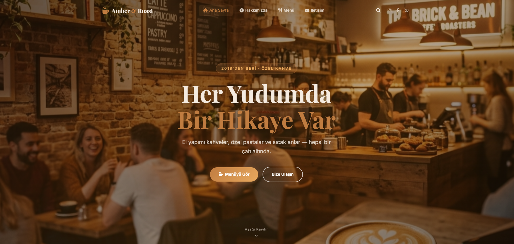

# Amber-Roast-Specialty-Coffee-Site-For-Education
A modern, responsive, and interactive coffee shop website for Amber &amp; Roast. Built with HTML5, CSS3 (using custom properties), and Vanilla JavaScript.

# ☕ Amber & Roast - Specialty Coffee Website

Amber & Roast is a modern and user-friendly website designed for a specialty coffee shop established in Istanbul in 2018. This project combines an aesthetic user interface with a fluid user experience, emphasizing the "Every Sip Has a Story" philosophy.



## ✨ Features
- **Fully Responsive Design:** Optimized for seamless viewing on desktops, tablets, and mobile devices.
- **Scroll Reveal Animations:** Content gracefully fades into view as the user scrolls, powered by the Intersection Observer API.
- **Dynamic Statistics Counter:** Animated counters for business metrics (cups served, years in business, etc.).
- **Interactive Menu Filtering:** Instant category-based filtering (Hot, Cold, Pastry, etc.) for the product menu using Vanilla JS.
- **Advanced Form Validation:** Real-time error handling and Regex validation for the contact form.
- **Modern UI/UX:** A balanced typographic scale using Playfair Display and Inter fonts with an earthy color palette.

## 🛠️ Technologies Used
- **HTML5:** Semantic structure and SEO-friendly markup.
- **CSS3:** Advanced layouts with Flexbox and Grid, custom properties (variables), and smooth transitions.
- **Vanilla JavaScript:** Pure JS implementation for all interactive features without external libraries.
- **Font Awesome:** For modern, scalable iconography.
- **Google Fonts:** For high-quality typography.

## 📁 Project Structure
```text
├── css/
│   └── style.css      # Global styles and layout configurations
├── js/
│   └── script.js     # Interactivity, animations, and form logic
├── img/              # Image assets and icons
├── index.html        # Home Page
├── about.html        # About Us Page
├── menu.html         # Menu & Filtering Page
└── contact.html      # Contact Form & Location Page
🚀 Installation & Usage
To run this project locally:

Clone the repository: git clone https://github.com/yourusername/Amber-Roast-Specialty-Coffee.git

Open index.html in any modern web browser.

Developed by Ali Kajeviç.
